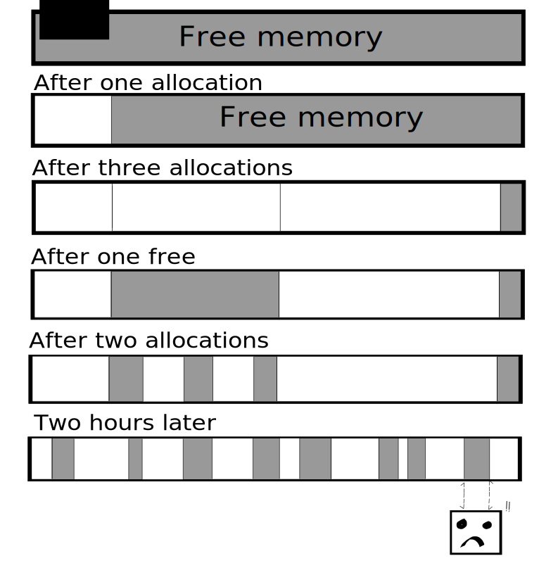

maskerad memory allocators
========================
**custom allocators, for memory fragmentation prevention.**

 

Presentation
------------

This Rust library is **nightly-only** and provides: 
- a **stack-based** allocator

This allocator is a vector-like data structure, which asks **n** number of bytes from the heap
when instantiated.

- a **double-buffered** allocator

It is a structure holding two stack-based allocators. One is active, the other is inactive.
When we allocate/reset with this allocator, the active stack-based allocator allocates/reset memory.
We can swap the allocators, the inactive one becomes active.

- a **double-ended** allocator

It works like a stack-based allocator, but allocations can occur on both sides. *Technically* it doesn't work
like that, but that's the idea.

All those type of allocators are available for structures implementing the **Copy** trait **OR** the **Drop** trait.

This library was made to **prevent memory fragmentation**. The allocators preallocate memory from the heap,
and we use those allocators to create objects.

Usage
-----
### Installation

This library is available on [crates.io](https://crates.io/crates/maskerad_memory_allocators)

### Examples
Refer to the [documentation](https://docs.rs/maskerad_memory_allocators) for some examples.

### Use case: game loops

With those types of allocators, memory is freed only when the allocator is dropped, we can just *reset*
the allocators.

it means we may **override currently used memory** !

Not in a game loop :
- We allocate at the beginning of the loop.
- We consume in the loop.
- We reset at the end of the loop.

At the start of the loop **n**, we can be sure that the data allocated in the loop **n - 1** is not longer used or needed.

It means that data allocated during frame **n** must only be usable during frame **n**, not **n + 1** !

If you need to use data created at frame **n** for the frame **n + 1**, the **double buffered allocator** can solve your problem.

### Potential benefices compared to heap allocation
It *can* be **faster**: Allocations and *frees* move a pointer, that's all.

It prevents **memory fragmentation**: Allocation is always contiguous, memory cannot be fragmented over time.

Context
---------------------------------------
### Purpose of custom allocators

Time-constrained programs, like video-games, need to be as fast as possible.

A video-game, in its game loop, needs to :
- Read the player's input at frame **n**.
- Update the world state (AI, physics, object states, sounds...) at frame **n**.
- Draw the scene at frame **n** in the back buffer.
- Swap the back buffer (frame **n**) with the current buffer (frame **n - 1**).

In order to display **60** frames per second, this loop needs to be completed in **16** milliseconds (**0.016** seconds).

### Problems about general-purpose memory allocators
One possible bottleneck is **dynamic** memory allocation (allocation on the **heap**), which *can* be slow.

Moreover, memory can become **fragmented** over time :

Even though we have enough **total** memory, this memory is not **contiguous** so we can't
 allocate anything.

Custom memory allocators can help with both problems.

We can distinguish 3 types of memory allocation :
- **Persistent** memory allocation: data is allocated when the program is started, and freed when
the program is shut down. The [arena crate](https://doc.rust-lang.org/1.1.0/arena) or a stack-based allocator can help here.

- **Dynamic** memory allocation: data is allocated and freed during the lifetime of the program, but
we can't predict *when* this data is allocated and freed. An [Object Pool](https://github.com/Maskerad-rs/Maskerad_memory_allocator)
can be a good data structure to deal with this type of memory allocation.

- **One-Frame** memory allocation: Data is allocated, consumed and freed in a loop. This allocator
can be useful with this type of memory allocation.

## More informations on the subject
[Game Engine Architecture, chapter 5.2](http://gameenginebook.com/toc.html)

[Stack Overflow answer about memory fragmentation](https://stackoverflow.com/questions/3770457/what-is-memory-fragmentation#3770593)

[Stack Overflow answer about stack-based allocators](https://stackoverflow.com/questions/8049657/stack-buffer-based-stl-allocator)

[SwedishCoding blogpost about custom memory allocators](http://www.swedishcoding.com/2008/08/31/are-we-out-of-memory)

[Game Programming Patterns, Chapter 19, about Object Pools](http://gameprogrammingpatterns.com/object-pool.html)

[Wikipedia article about Object Pools](https://en.wikipedia.org/wiki/Memory_pool)

## License

Licensed under either of

 * Apache License, Version 2.0, ([LICENSE-APACHE](LICENSE-APACHE) or http://www.apache.org/licenses/LICENSE-2.0)
 * MIT license ([LICENSE-MIT](LICENSE-MIT) or http://opensource.org/licenses/MIT)

at your option.

## Contribution

Unless you explicitly state otherwise, any contribution intentionally submitted
for inclusion in the work by you, as defined in the Apache-2.0 license, shall be dual licensed
as above, without any additional terms or conditions.
